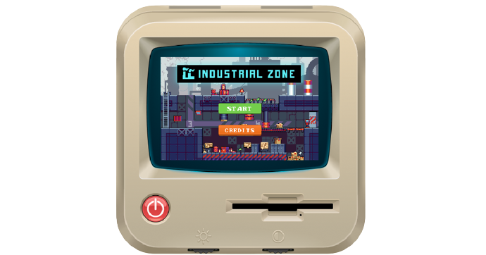

# Industry

## Description
Industry is a web-based game where players combine raw materials to create products.

## Navigation
- **HomePage**: Contains credits, help, and start buttons.
- **GamePages**: Where the gameplay takes place.

## Features
- On game start, there's a grid with images of the raw materials.

## Objective
The player's goal is to select the correct raw materials from the grid by clicking on them one by one. After selecting what they believe is the right combination, they must hit the "done" button below the grid. The game validates if the items chosen are the correct combination for the level. If correct, the player wins and proceeds to the next level. Each level features a different product to manufacture.

## Rules
- The game consists of 3 levels.
- Each level is timed:
  - Level 1: 15 seconds
  - Level 2: 10 seconds
  - Level 3: 7 seconds
- The player starts with 3 lives in each level.
- Incorrectly selecting a raw material deducts a life.
- Losing all lives results in a game over.
- Running out of time also results in a game over.

## Installation
- Clone the repository.
- Open the game in a web browser.
- You can play the game at https://mr-vance.github.io/industry/

## License
This project is licensed under the [MIT License](LICENSE).

## Credits
- Wouldn't have done it without the extra push from the [Lazy Devs](https://discord.gg/nmwMGYTKSn) fam.
- This game was developed as part of the game jam that took place in October 2023. More details on [itch.io](https://itch.io/jam/lazy-jam-oct-2023)
- Development Framework: [PhaserJS](https://phaser.io/)

## Support or Contact
For the sake of all that is good, please follow me on X. [@br_vance](https://x.com/br_vance)
